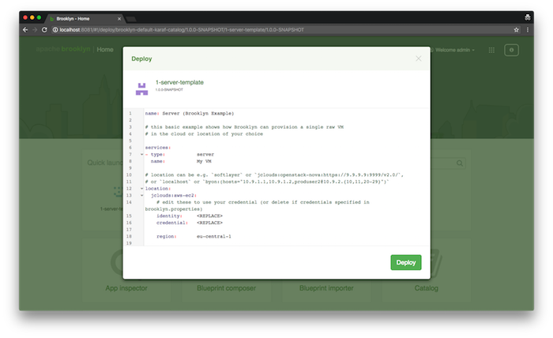

A `template` item type is a full application or service. It consists of one or more entities together with policies, configuration, parameters and locations.
It is also composable: it can be used as an entity in another entity or application template.

The "Home" screen in the UI includes a "Quick Launch" bar which by default shows all items in the catalog with `itemType: template`,
making it easy for users to deploy things without any composition.
When an item is selected, it can be simply configured and immediately deployed,
or it can be edited in a simple in-line YAML editor
or it can be opened in the composer.

If the template is a valid plan without a location, the simple configuration view is used.
This prompts a user to select a name, location, and values for the config parameters.
The user can then easily deploy it, or if they wish open it in one of the other two modes.
The simple YAML editor will edit the YAML that _references_ the template,
whereas the composer will actually load the YAML _of_ the item, with any values set in the simple view.

If the template declares a location -- or if the template is not valid YAML -- then the simple editor is opened immediately,
with the template loaded exactly as it is defined. Comments can be included to facilitate editing.

It is also possible to curate which items appear in "Quick Launch", and which locations.
If the tag `catalog_quick_launch` is set on _any_ template in the catalog,
then _only_ templates with that tag will be displayed.
(If nothing has such a tag, then all templates are displayed.)
Of course other tags can be added as usual.

Similarly with locations, if any locations have that tag, then only locations with that tag will be available in the deploy dropdown.
If there is only one location, it is pre-selected. So by tagging just one location, it can be ensured to be automatically selected.
Additionally if any locations have that tag, the "Create Location" option is suppressed,
as it is assumed the Quick Launch is being used in a curated environment where that option is not meant for end-users.
(This can be changed through config options in the code, for users who wish to produce their own UI.)

For example, the following catalog BOM will add a template for a single server to the catalog,
ensuring it appears in Quick Launch (with the tag),
and triggering the simple YAML editor when opened (because it has a location defined):

~~~ yaml
brooklyn.catalog:
 items:
  - id: 1-server-template
    itemType: template
    name: "Template 1: Server"
    tags: [ catalog_quick_launch ]
    description: |
      Sample YAML to provision a server in a cloud with illustrative VM properties
    item:
      name: Server (Brooklyn Example)

      # this basic example shows how Brooklyn can provision a single raw VM
      # in the cloud or location of your choice

      services:
      - type:           server
        name:           My VM

      # location can be e.g. `softlayer` or `jclouds:openstack-nova:https://9.9.9.9:9999/v2.0/`,
      # or `localhost` or `byon:(hosts="10.9.1.1,10.9.1.2,produser2@10.9.2.{10,11,20-29}")`
      location:
        jclouds:aws-ec2:
          # edit these to use your credential (or delete if credentials specified in brooklyn.properties)
          identity:     <REPLACE>
          credential:   <REPLACE>

          region:       eu-central-1

          # we want Ubuntu, with a lot of RAM
          osFamily:     ubuntu
          minRam:       8gb

          # set up this user and password (default is to authorize a public key)
          user:         sample
          password:     s4mpl3
~~~

 

