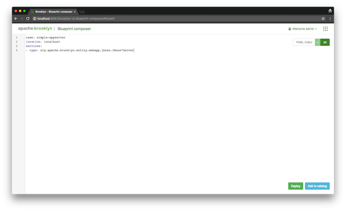

# {{ page.title }}

## A First Blueprint

The easiest way to write a blueprint is as a YAML file.
This follows the  <a href="https://www.oasis-open.org/committees/camp/">OASIS CAMP</a> plan specification, 
with some extensions described below.
(A [YAML reference]({{book.path.docs}}/blueprints/yaml-reference.md) has more information,
and if the YAML doesn't yet do what you want,
it's easy to add new extensions using your favorite JVM language.)

### The Basic Structure

Here's a very simple YAML blueprint plan, to explain the structure:

!CODEFILE "example_yaml/simple-appserver.yaml"

* The `name` is just for the benefit of us humans.

* The `location` specifies where this should be deployed.
  If you've [set up passwordless localhost SSH access]({{book.path.docs}}/locations/index.md#localhost) 
  you can use `localhost` as above, but if not, just wait ten seconds for the next example.
  
* The `services` block takes a list of the typed services we want to deploy.
  This is the meat of the blueprint plan, as you'll see below.

Finally, the clipboard in the top-right corner of the example plan box above (hover your cursor over the box)  lets you easily copy-and-paste into the web-console:
simply [download and launch]({{book.path.docs}}/start/running.md) Brooklyn,
then in the "Create Application" dialog at the web console
(usually [http://127.0.0.1:8081/](http://127.0.0.1:8081/), paste the copied YAML into the "Yaml" tab of the dialog and press "Finish". 
There are several other ways to deploy, including `curl` and via the command-line,
and you can configure users, https, persistence, and more, 
as described [in the ops guide]({{book.path.docs}}/ops/index.md).

<!--
TODO building up children entities

-->

### More Information

Topics to explore next on the topic of YAML blueprints are:

Plenty of examples of blueprints exist in the Brooklyn codebase,
so another starting point is to [`git clone`]({{ book.url.brooklyn_website }}/developers/code/index.html) it
and search for `*.yaml` files therein.

Brooklyn lived as a Java framework for many years before we felt confident
to make a declarative front-end, so you can do pretty much anything you want to
by dropping to the JVM. For more information on Java:

* start with a [Maven archetype]({{book.path.docs}}/blueprints/java/archetype.md)
* see all [Brooklyn Java guide]({{book.path.docs}}/blueprints/java/index.md) topics
* look at test cases in the [codebase](https://github.com/apache/brooklyn)

You can also come talk to us, on IRC (#brooklyncentral on Freenode) or
any of the usual [hailing frequencies]({{book.url.brooklyn_website}}/community/),
as these documents are a work in progress.
